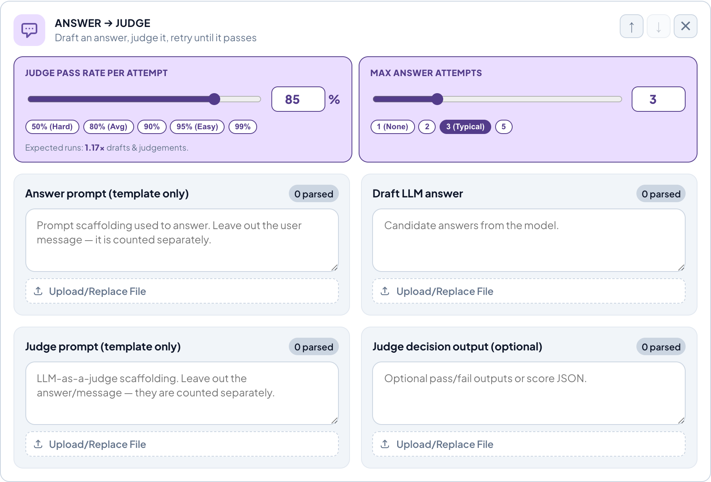
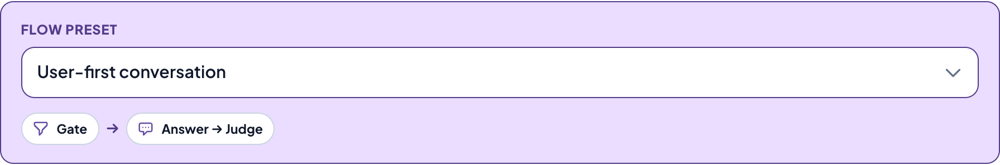

# Azure OpenAI Budget Estimator

A browser-based calculator that turns **real prompt/message samples** into an
**annual Azure OpenAI spend estimate**. Instead of guessing "tokens per request,"
you paste representative messages, the app tokenizes them with the same encoder the
models use, and a probabilistic workflow model projects yearly input/output tokens and
cost across a whole user base.

> **New here?** Open the [visual walkthrough:](https://htmlpreview.github.io/?https://github.com/javierg1975/llm-usage-calculator/blob/develop/docs/tutorial.html)
>  — or open [`docs/tutorial.html`](docs/tutorial.html) locally in a browser.

---

## Why this exists

Most cost estimates start from a guessed "average tokens per call." That number is
usually wrong, and the error compounds when you multiply by millions of conversations.
This tool replaces the guess with three measured inputs:

1. **What your traffic actually looks like** — paste sample messages and prompts.
2. **How a conversation actually runs** — compose the flow from stages (opening, gate,
   answer→judge loop, generic call) in a visual designer, not a single flat call. Gates
   scale everything downstream; the answer→judge loop retries.
3. **How engaged your users actually are** — a distribution of light → power users
   rather than one flat "average user," shown as a per-preset histogram.

It then multiplies these out to an annual token and dollar figure, broken down by user
segment, updating live as you type.

---

## Prerequisites

This project was built and tested with [**bun**](https://bun.sh/), and only `bun.lock`
is committed. Use bun if you can:

- **bun** (recommended) — install from [bun.sh](https://bun.sh/) (e.g.
  `curl -fsSL https://bun.sh/install | bash`). It bundles its own runtime, so that's the
  only thing you need.
- **Node.js + npm** — install [Node.js](https://nodejs.org/) 18+ (npm ships with it).
  Untested: there's no `package-lock.json`, so npm resolves dependencies fresh from
  `package.json` and may pull different versions than bun pinned. It will probably work,
  but bun is the known-good path.

If you have neither, start with bun.

## Quick start

### Option A: bun

```bash
bun install
bun run dev
```

### Option B: npm

```bash
npm install
npm run dev
```

Open the URL shown in the terminal (typically `http://localhost:5173`).

## Try it with the demo samples

You don't need your own logs to explore the app. The [`samples/`](./samples) directory
holds ready-made files for a customer-support assistant.

1. In the app, expand a conversation flow. The **shared user message** is a flow-level
   block; each stage (gate, answer→judge, …) is its own block with its rate knobs and
   sample fields inline. Add, remove, or reorder stages from the palette.
2. In each block, use the file picker to load the matching file from `samples/`
   (see [`samples/README.md`](./samples/README.md) for the field-to-file mapping).
3. Click **Estimate workflow** — the per-conversation token averages update from your
   samples. The rate knobs then scale the live cost estimate instantly as you move them.

<p align="center">
  
</p>

---

## How the estimate is built

The calculation runs in three layers, each isolated in `src/lib/` and unit-tested.

### 1. Tokenization — `tokenization.ts`

Counts tokens with [`js-tiktoken`](https://github.com/dqbd/tiktoken) using the
**`o200k_base`** encoding — the tokenizer used by the GPT-4o → GPT-5 generation of
OpenAI models (and the `o1`/`o3`/`o4` reasoning models). It runs the same encoder the
models use, so counts are exact rather than estimated.

### 2. Sample parsing & token math — `sampleText.ts`

Turns pasted text or uploaded files into per-message averages. It accepts two formats:

- **Plain text** — one sample per non-empty line.
- **JSON** — arrays or nested objects (e.g. chat transcripts). Text is pulled from known
  keys (`content`, `text`, `prompt`, `message`, `response`, …) while envelope fields like
  `role`, `id`, and `timestamp` are ignored, so structure never inflates token counts.

### 3. Workflow & cost model — `conversationWorkflow.ts` + `calculator.ts`

Each conversation flow is an **ordered list of stages** you compose in the designer.
`combineFlowStages` folds over that list tracking a running **reach probability** (the
chance a conversation gets this far) and accumulating tokens and call counts:

| Stage | What it does | Tokens |
| --- | --- | --- |
| **Opening** | Assistant sends the first message | 1 call: opening prompt → message |
| **Gate** | Classifier that decides whether to engage | 1 call; **multiplies downstream reach by its pass rate** |
| **Answer → Judge** | Draft an answer, judge it, retry until it passes | coupled loop; calls = reach × E[attempts] |
| **LLM call** | Generic single call | 1 call: prompt → response |

- A **gate** is the only stage that branches: everything after it is scaled by its
  engage rate, so a gate at 80% means later stages run on 80% of conversations.
- The **answer → judge** loop is coupled (the judge's verdict is what triggers an answer
  regeneration). Expected attempts follow a truncated-geometric expectation:

  ```
  E[attempts] = (1 − (1 − passRate)^maxAttempts) / passRate
  ```

- The two stock presets are just default stage lists — `[gate, answerJudge]` (user-first)
  and `[opening, gate, answerJudge]` (assistant-first) — and reproduce the original
  fixed-pipeline numbers exactly (there are equivalence tests for this).
- Expected **input** tokens per conversation sum the prompt + shared-message tokens across
  the expected (reach-scaled) call counts; expected **output** tokens sum the generated
  decisions and answers. The shared user message is a flow-level input every gate / answer
  / judge call sees.
- A global **API reliability** factor accounts for transport-level call failures
  (timeouts, 5xx, rate limits) that are transparently retried. Modeled as a
  truncated-geometric overhead `(1 − (1 − successRate)^maxAttempts) / successRate` and
  applied to **input tokens only** — a failed call rarely bills for output. The default
  (99% success / 3 attempts ≈ 1.01×) barely moves the total; raise it for flaky infra,
  or set success to 100% to disable.
- `calculator.ts` then scales per-user tokens across an **engagement distribution**
  (light/standard/heavy/power users with per-segment multipliers and largest-remainder
  user allocation) and applies per-million input/output pricing to produce the annual
  budget.

<p align="center">
  
</p>

### Modeling assumptions (read these before relying on the number)

- **Cached-input pricing is excluded.** The shared user message is counted as fresh input
  on every answer and judge call, so input tokens are an **upper bound** — real spend can
  be lower when prompt caching applies.
- **Prompt samples are the template only.** In production the user message is interpolated
  *into* each prompt before the call; the estimator instead counts the prompt scaffolding
  and the message separately and sums them (≈ the same total, and a conservative upper
  bound). So paste only the prompt scaffolding into the gate/answer/judge prompt fields —
  if you include the user message or draft answer there, it gets double-counted.
- Token **averages** from your samples are treated as representative of all traffic.
- Prices are static values in `src/lib/models.ts` (Azure Data Zone list prices); verify
  against the [official Azure pricing page](https://azure.microsoft.com/en-us/pricing/details/azure-openai/)
  before relying on a figure.

---

## Project layout

```
src/
  App.tsx                       orchestrator: state + composes the four cards
  format.ts                     shared Intl number formatters
  lib/                          pure, unit-tested domain (no React)
    tokenization.ts             js-tiktoken (o200k_base) token counter
    sampleText.ts               parse messages/JSON → per-message token stats
    conversationWorkflow.ts     stage-fold engine (combineFlowStages) + retry math
    calculator.ts               distribution scaling + annual cost
    models.ts                   Azure Data Zone model prices
    distributions.ts            engagement distribution presets
    frequency.ts                per day/week/month/year → annual conversion
    types.ts                    shared domain types
    *.test.ts                   unit tests (Vitest)
  flow/                         flow designer model (plain TS, app-specific)
    stageCatalog.ts             stage palette: icons, knobs, sample slots
    flowModel.ts                flow types, presets, deriveFlow / toWorkload
    useFlows.ts                 flows state + every handler (the hook)
  components/                   one React component per card / piece of UI
    CoreAssumptionsCard.tsx     section 1: model, users, API reliability
    EngagementDistributionCard  section 2: selectable distribution histograms
    DistributionSparkline.tsx   the per-distribution SVG histogram
    WorkflowDefinitionsCard     section 3: the flow list + add-flow
    FlowCard.tsx                one flow (preset, cadence, stage stack)
    StageBlock.tsx              one stage (rate knobs, sample fields)
    ResultsPanel.tsx            section 4: live annual estimates
samples/                        demo prompt/message files
docs/
  tutorial.html                 visual walkthrough
  img/                          screenshots used by the docs
```

## Useful commands

```bash
bun run dev       # Start the dev server
bun run build     # Type-check + production build
bun run preview   # Preview the production build
bun run test      # Run the unit-test suite once
bun run test:watch
bun run lint      # ESLint
```

(`npm run …` works for all of the above as well.)

## Testing

The token pipeline is covered end-to-end, including tests that exercise the **real**
`o200k_base` encoder against anchored token counts and a hand-computed workflow scenario,
plus tests that load the demo `samples/` files and assert the full estimate runs. Run:

```bash
bun run test
```
