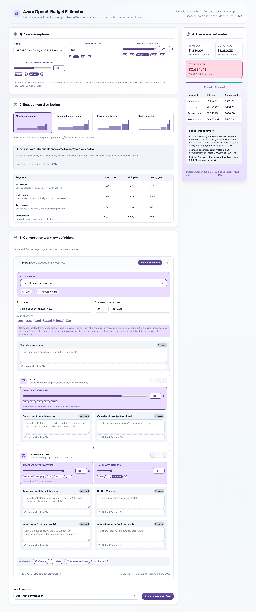

# Azure OpenAI Budget Estimator

A browser-based calculator that turns **real prompt/message samples** into an
**annual Azure OpenAI spend estimate**. Instead of guessing "tokens per request,"
you paste representative messages, the app tokenizes them with the same encoder the
models use, and a probabilistic workflow model projects yearly input/output tokens and
cost across a whole user base.

<p align="center">
  
</p>

> **New here?** Open the visual walkthrough: [`docs/tutorial.html`](docs/tutorial.html)
> (open it directly in a browser).

---

## Why this exists

Most cost estimates start from a made-up "average tokens per call." That number is
almost always wrong, and the error compounds when you multiply by millions of
conversations. This tool replaces the guess with three grounded inputs:

1. **What your traffic actually looks like** — paste sample messages and prompts.
2. **How a conversation actually runs** — a `trigger → gate → answer → judge` pipeline
   with a retry loop, not a single call.
3. **How engaged your users actually are** — a distribution of light → power users
   rather than one flat "average user."

It then multiplies these out to an annual token and dollar figure, broken down by user
segment, updating live as you type.

---

## Quick start

### Option A: bun

```bash
bun install
bun run dev
```

### Option B: npm

```bash
npm install
npm run dev
```

Open the URL shown in the terminal (typically `http://localhost:5173`).

## Try it with the demo samples

You don't need your own logs to explore the app. The [`samples/`](./samples) directory
holds ready-made files for a customer-support assistant.

1. In the app, expand a conversation flow and open the **Token Estimation Samples** tab.
2. Under each field, use the file picker to load the matching file from `samples/`
   (see [`samples/README.md`](./samples/README.md) for the field-to-file mapping).
3. Click **Estimate workflow** — the per-conversation token averages and the live cost
   estimate update from your samples.

<p align="center">
  
</p>

---

## How the estimate is built

The calculation runs in three layers, each isolated in `src/lib/` and unit-tested.

### 1. Tokenization — `tokenization.ts`

Counts tokens with [`js-tiktoken`](https://github.com/dqbd/tiktoken) using the
**`o200k_base`** encoding — the exact tokenizer used by the GPT-4o → GPT-5 generation of
OpenAI models (and the `o1`/`o3`/`o4` reasoning models). This is a real, battle-tested
tokenizer, not an approximation.

### 2. Sample parsing & token math — `sampleText.ts`

Turns pasted text or uploaded files into per-message averages. It accepts two formats:

- **Plain text** — one sample per non-empty line.
- **JSON** — arrays or nested objects (e.g. chat transcripts). Text is pulled from known
  keys (`content`, `text`, `prompt`, `message`, `response`, …) while envelope fields like
  `role`, `id`, and `timestamp` are ignored, so structure never inflates token counts.

### 3. Workflow & cost model — `conversationWorkflow.ts` + `calculator.ts`

Each conversation flow is modeled as a pipeline:

```
trigger → gate (engage?) → answer ⇄ judge (retry until pass or max attempts)
```

- The **gate** decides whether the assistant engages (`engageRate`).
- Each engagement runs an **answer → judge** loop. Expected attempts follow a
  truncated-geometric expectation:

  ```
  E[attempts] = (1 − (1 − passRate)^maxAttempts) / passRate
  ```

- Expected **input** tokens per conversation sum the prompt + message tokens across the
  expected number of gate, answer, and judge calls; expected **output** tokens sum the
  generated decisions and answers.
- `calculator.ts` then scales per-user tokens across an **engagement distribution**
  (light/standard/heavy/power users with per-segment multipliers and largest-remainder
  user allocation) and applies per-million input/output pricing to produce the annual
  budget.

<p align="center">
  
</p>

### Modeling assumptions (read before trusting the number)

- **Cached-input pricing is excluded.** The shared user message is counted as fresh input
  on every answer and judge call, so input tokens are an **upper bound** — real spend can
  be lower when prompt caching applies.
- Token **averages** from your samples are treated as representative of all traffic.
- Prices are static values in `src/lib/models.ts` (Azure Data Zone list prices); verify
  against the [official Azure pricing page](https://azure.microsoft.com/en-us/pricing/details/azure-openai/)
  before relying on a figure.

---

## Project layout

```
src/
  App.tsx                       UI: inputs, live dashboard, sample loaders
  lib/
    tokenization.ts             js-tiktoken (o200k_base) token counter
    sampleText.ts               parse messages/JSON → per-message token stats
    conversationWorkflow.ts     gate + retry model → tokens per conversation
    calculator.ts               distribution scaling + annual cost
    models.ts                   Azure Data Zone model prices
    distributions.ts            engagement distribution presets
    frequency.ts                per day/week/month/year → annual conversion
    types.ts                    shared domain types
    *.test.ts                   unit tests (Vitest)
samples/                        demo prompt/message files
docs/
  tutorial.html                 visual walkthrough
  img/                          screenshots used by the docs
```

## Useful commands

```bash
bun run dev       # Start the dev server
bun run build     # Type-check + production build
bun run preview   # Preview the production build
bun run test      # Run the unit-test suite once
bun run test:watch
bun run lint      # ESLint
```

(`npm run …` works for all of the above as well.)

## Testing

The token pipeline is covered end-to-end, including tests that exercise the **real**
`o200k_base` encoder against anchored token counts and a hand-computed workflow scenario,
plus tests that load the demo `samples/` files and assert the full estimate runs. Run:

```bash
bun run test
```
